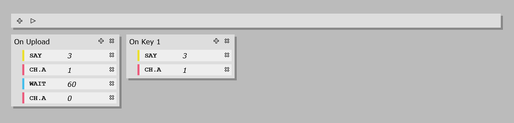

# SmartPlug

## Features

* Control up to 4 loads.
* Receiving signals from 4 buttons/sensors.
* Buzzer and led notifications.
* Flexible and versatile commands.
* Fully open source.

The device is based on the [Raspberry Pi Pico W](https://www.raspberrypi.com/products/raspberry-pi-pico/) - an inexpensive board with Wi-Fi support.
It acts as a web server hosting a web application.
No additional software or hardware required other than your desktop or phone and a browser.

## Set up and connection

First you need to enter your wireless network name and password in the main.py file.
There are a few other options here, such as the number of output channels and input buttons.
Then [flash your pico](https://picockpit.com/raspberry-pi/raspberry-pi-pico-and-micropython-on-windows) with MicroPython and upload the files (main.py, main.js, index.htm, close.svg, plus.svg, upload.svg) to it.
After rebooting the board will connect to the network. 
Then you need to find out the IP of the board and open it with your browser:

## SmartPlug programming

The programme consists of event handlers, each of which triggers a sequence of commands.
The following events are currently supported:
* OnUpload - Run immediately after uploading the programme to the board
* OnReset - Run immediately after the board reboots
* OnKey0...OnKey3 - Run when a button is pressed

And commands:
* Say - User notification by buzzer or LED sequence
* Wait - Delay for a specified amount seconds
* Ch.A...Ch.D - Change the output's state

When you are finished editing the programme, press the Upload button to send it to SmartPlug.

## Roadmap

* Event to start commands at specified time
* Delay time in HH:MM:SS format
* Halt command to stop all commands and loads
* Event on load connected/disconnected
* Wi-Fi on/off command
